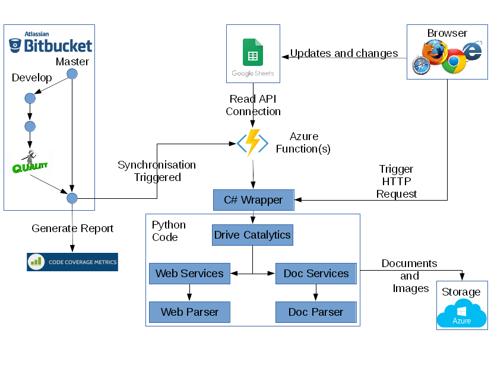

# Catalytics Scraping #

code: Directory for running catalytics.  
docs: Directory for documentation to describe the code.

---

Current version of Python is:  
`$ python --version`  
Python 2.7.5

## Installation of 'pip' modules for python.

Upgrade to the latest version of pip for your OS before installing any packages.  
`$ python -m pip install -U pip`  

Install Beautiful Soup to process response from web server.  
`$ sudo pip install bs4`

Install requests so can talk to web servers.  
`$ sudo pip install requests`

Install pathlib so can check if files already exist.  
`$ sudo pip install pathlib`

Install so can create files in excel spreadsheet format.  
`$ sudo pip install xlwt`  
`$ sudo pip install lxml`

Install so can create PDF files.  
`$ sudo pip install reportlab`  

Install so can cleanse PDF files.  
`$ sudo pip install pdfcropmargins`  

Install so can talk to Azure Storage.  
`$ sudo pip install azure`  

Install so can talk to Google Sheets.  
`# sudo pip install --upgrade google-api-python-client`  

Install pytest so can run regression test suite.  
`$ sudo pip install pytest`  

Install so can generate a code coverage report.  
`$ sudo yum install python-devel gcc`  
`$ sudo pip install --upgrade coverage`  

After installation expect to see coverage installed with C extension so it runs faster.  
`$ coverage --version`  
Coverage.py, version 4.4.1 with C extension  
Documentation at https://coverage.readthedocs.io  

## Setup on Azure  
Go to KUDO command shell on Azure.  
Create a viruatl environment directory called venv.  
`python -m virtualenv venv`  

Start the virtual environment  
`$ venv\Scripts\activate`  

Install the python modules needed for Catalytics scraping.  
`$ easy_install lxml`  
`$ pip install -r requirements.txt`  

Stop the virtual environment  
`$ venv\Scripts\deactivate`  

## Environment
To tell Python where to find its certificate authority we need to set
the REQUESTS_CA_BUNDLE environment variable.  
``$ export REQUESTS_CA_BUNDLE=/etc/ssl/certs/ca-bundle.crt``

## Branches
Two main branches  
 - Master  
 - Develop  

## Google Sheet
[Configuration Google sheet](https://docs.google.com/spreadsheets/d/1b9jCm0qMOHaw819uYBhPExKcQryYNgHbL1OG1suNhcU/edit#gid=0).  

## Execution
From the command line run the script (ex. Row 24 of the Google sheet):  
`$ python ./code/driveCatalytics.py --output /tmp/outputdir/ 24`

From the browser use the URL (ex. Row 24 of the Google sheet):  
`https://drivecatalytics.azurewebsites.net/api/ExternalTableCSharp1?code=W8Am7Zo8PClrIlKkmR59a8FQ8rOwbWm8ZrBKUXlJHribCk8rbHVrFg==&row=24`

Shall output files into the output directory format:  

<output dir>/CSV/<retailer>-<location/<retailer>-<location>_<yyyy>_<mm>_<dd>.csv
<output dir>/PDF/<retailer>-<location/<retailer>-<location>_<yyyy>_<mm>_<dd>.csv
<output dir>/PDF_FINAL/<retailer>-<location/<retailer>-<location>_<yyyy>_<mm>_<dd>.csv
<output dir>/XLSX/<retailer>-<location/<retailer>-<location>_<yyyy>_<mm>_<dd>.csv
<output dir>/IMAGES/<retailer>-<location>_<yyyy>_<mm>_<dd>/<store item cleansed description>.jpg

An example of this naming convention would be:  
/tmp/outputdir/CSV/Aldi-CA/Aldi-CA_2017_01_22.csv  

To view a XLS file on Linux:  
``$ soffice --nologo output/XSLX/sample.xls``  

To view a PDF file on Linux:  
``$ evince output/PDF_FINAL/sample.pdf``  

## Testing  
To run the full regression test suite.  
``$ pytest``  
To see the print statements within the full regression suite.  
``$ pytest -s``  
To run a single test file.  
``$ pytest test_dateformats.py``  
To run a single testcase.  
``$ pytest test_dateformates.py::TestDateFormats::test_blank``  

To run Code Coverage on the source code.  
``$ coverage run --source Catalog.py,DataCleanse.py,DocumentParsers.py,DocumentServices.py,driveCatalytics.py,StoreItem.py,WebParsers.py,WebServices.py -m pytest``  
To generate code coverage report and to include missing statements.  
``$ coverage report --show-missing``  
To generate code coverage report in html format.  
``$ coverage html --title=Catalytics``  

##Design
Catalytics Scraping is performed through procedure calls from a main driver.

Web Services provide the ability to scrape data from retailer's websites and load the results into internal datastructures.

Document Services provide the ability to write data to various document formats such as XLS (ExceL Spreadsheet) and CSV (Comma Separated Values).

